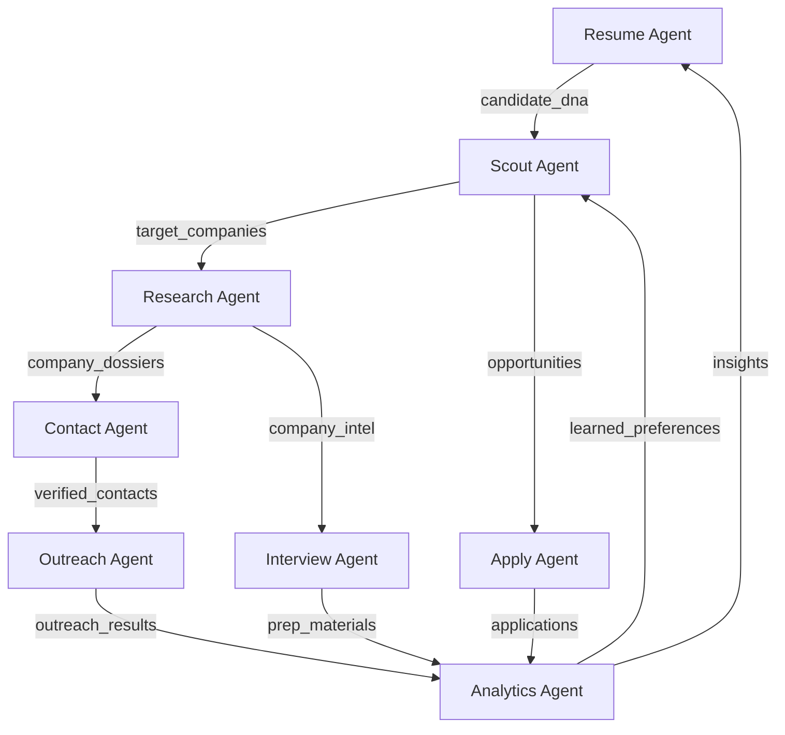
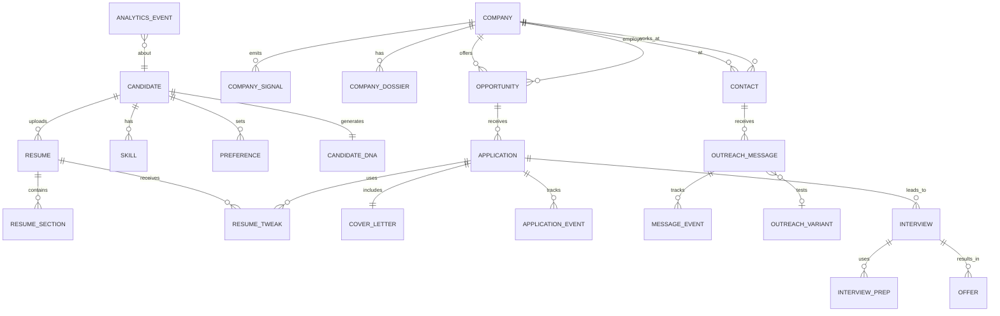
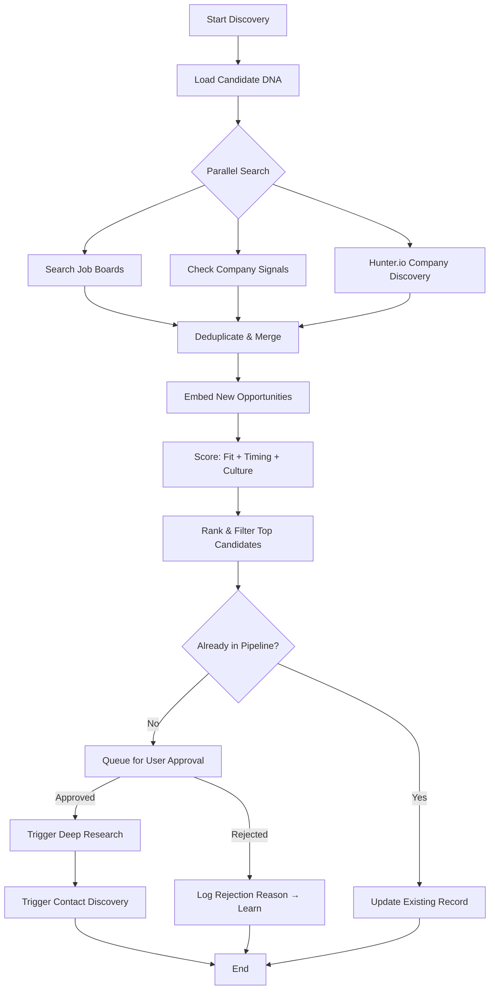
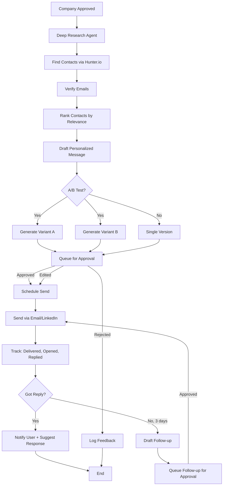
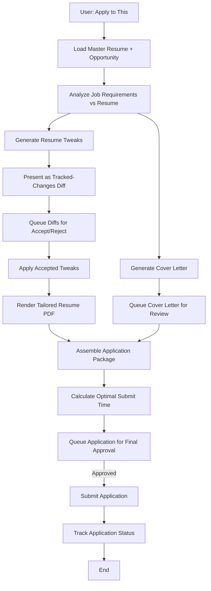
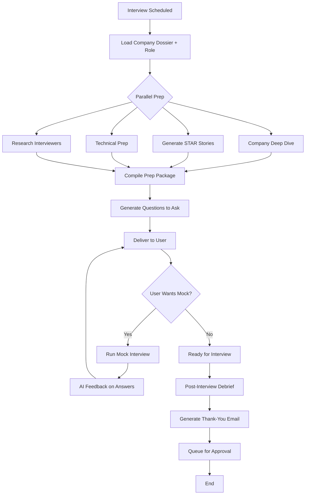
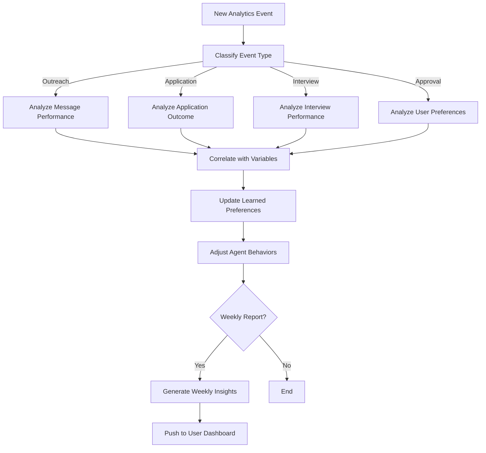

# JobHunter AI - System Design Document

> An intelligent, semi-automated job search system that thinks like a career strategist.

---

## Table of Contents

1. [System Architecture](#1-system-architecture)
2. [Data Model Design](#2-data-model-design)
3. [Agent Workflow Designs](#3-agent-workflow-designs)
4. [API Integration Plan](#4-api-integration-plan)
5. [MVP Scoping](#5-mvp-scoping)
6. [Technical Spike List](#6-technical-spike-list)
7. [Competitive Moat Analysis](#7-competitive-moat-analysis)

---

## 1. System Architecture

### 1.1 High-Level Overview

The system is a **multi-agent orchestration platform** with a human-in-the-loop approval layer. Eight specialized AI agents coordinate through a shared state graph, each responsible for a distinct domain of the job search lifecycle.

```
┌─────────────────────────────────────────────────────────────┐
│                     NEXT.JS FRONTEND                        │
│  ┌──────────┐ ┌──────────┐ ┌──────────┐ ┌──────────┐      │
│  │ Dashboard │ │ Approval │ │ Company  │ │ Analytics│      │
│  │  & CRM   │ │  Queue   │ │ Dossiers │ │  & Learn │      │
│  └──────────┘ └──────────┘ └──────────┘ └──────────┘      │
└────────────────────────┬────────────────────────────────────┘
                         │ REST + WebSocket
┌────────────────────────┴────────────────────────────────────┐
│                     FASTAPI BACKEND                         │
│                                                             │
│  ┌────────────────────────────────────────────────────┐    │
│  │              APPROVAL GATEWAY                       │    │
│  │   Every outbound action queued for human review     │    │
│  └────────────────────────┬───────────────────────────┘    │
│                           │                                 │
│  ┌────────────────────────┴───────────────────────────┐    │
│  │           LANGGRAPH ORCHESTRATOR                    │    │
│  │                                                     │    │
│  │  ┌─────────┐ ┌─────────┐ ┌─────────┐ ┌─────────┐ │    │
│  │  │ Resume  │ │  Scout  │ │Research │ │ Contact │ │    │
│  │  │ Agent   │ │  Agent  │ │ Agent   │ │  Agent  │ │    │
│  │  └─────────┘ └─────────┘ └─────────┘ └─────────┘ │    │
│  │  ┌─────────┐ ┌─────────┐ ┌─────────┐ ┌─────────┐ │    │
│  │  │Outreach │ │  Apply  │ │Interview│ │Analytics│ │    │
│  │  │ Agent   │ │  Agent  │ │  Agent  │ │  Agent  │ │    │
│  │  └─────────┘ └─────────┘ └─────────┘ └─────────┘ │    │
│  └────────────────────────────────────────────────────┘    │
│                                                             │
│  ┌──────────┐ ┌──────────┐ ┌──────────┐ ┌──────────┐      │
│  │ Hunter.io│ │  OpenAI  │ │  Celery  │ │WebSocket │      │
│  │  Client  │ │  Client  │ │  Workers │ │  Manager │      │
│  └──────────┘ └──────────┘ └──────────┘ └──────────┘      │
└────────────────────────┬────────────────────────────────────┘
                         │
┌────────────────────────┴────────────────────────────────────┐
│                      DATA LAYER                             │
│  ┌──────────────┐  ┌──────────────┐  ┌──────────────┐      │
│  │  PostgreSQL   │  │    Redis     │  │ File Storage │      │
│  │  + pgvector   │  │  Cache/Queue │  │  (S3/local)  │      │
│  └──────────────┘  └──────────────┘  └──────────────┘      │
└─────────────────────────────────────────────────────────────┘
```

### 1.2 Technology Choices

| Layer | Technology | Rationale |
|-------|-----------|-----------|
| Frontend | Next.js 14 + TypeScript | SSR for dashboard perf, App Router for layouts, excellent DX |
| UI Components | shadcn/ui + Tailwind CSS | Accessible, customizable, consistent design |
| State Management | Zustand + React Query | Lightweight global state + server state caching |
| Real-time | WebSockets (native) | Approval notifications, agent progress updates |
| Backend | FastAPI (Python 3.12) | Async-native, great for AI workloads, OpenAPI docs |
| Agent Orchestration | LangGraph | DAG-based stateful agents, production-tested (Uber, LinkedIn, GitLab), MIT-licensed |
| Task Queue | Celery + Redis | Background jobs: scraping, email sending, signal monitoring |
| Scheduler | Celery Beat | Recurring jobs: signal checks, follow-up reminders, analytics |
| Primary DB | PostgreSQL 16 + pgvector | Relational data + vector embeddings in one DB, no extra infra |
| Cache/Broker | Redis | Session cache, rate limiting, Celery message broker |
| File Storage | Local filesystem → S3 | Resumes, generated documents, company logos |
| Containerization | Docker Compose | Unified local dev: API, workers, DB, Redis, frontend |
| AI Models | OpenAI Responses API | GPT-4o for generation, text-embedding-3-large for vectors |

**Why PostgreSQL + pgvector instead of a dedicated vector DB (Pinecone/Weaviate)?**
- Eliminates an entire infrastructure dependency
- Transactional consistency between relational and vector data
- pgvector handles millions of vectors with HNSW indexing at single-digit ms latency
- Can always migrate to a dedicated vector DB later if scale demands it

**Why LangGraph instead of raw function chains?**
- Built-in state persistence across agent steps
- Conditional branching (if company has no public email → try LinkedIn path)
- Parallel execution (research company + find contacts simultaneously)
- Human-in-the-loop interrupts are a first-class primitive
- Checkpointing for long-running workflows

### 1.3 Module Architecture

Each module maps to one or more **LangGraph agents**. Agents are Python classes with:

```python
# Pattern for every agent
class BaseAgent:
    """Base class for all JobHunter agents."""

    name: str                    # e.g., "scout_agent"
    description: str             # What this agent does
    tools: list[BaseTool]        # API calls, DB queries, web fetches
    system_prompt: str           # Role and constraints
    model: str                   # "gpt-4o" or "gpt-4o-mini"
    requires_approval: bool      # Does output need human sign-off?

    async def run(self, state: GraphState) -> GraphState:
        """Execute agent logic, return updated state."""
        ...

    async def submit_for_approval(self, action: PendingAction) -> None:
        """Queue an action for human review."""
        ...
```

**Module → Agent Mapping:**

| Module | Agent(s) | Approval Required? |
|--------|----------|-------------------|
| 1. Candidate Intelligence | `resume_agent` | No (internal analysis) |
| 2. Opportunity Radar | `scout_agent` | Yes (target company list) |
| 3. Company Research | `research_agent` | No (internal enrichment) |
| 4. Contact Intelligence | `contact_agent` | No (discovery is internal) |
| 5. Application Optimization | `apply_agent` | Yes (resume tweaks, cover letters) |
| 6. Outreach | `outreach_agent` | Yes (every message before sending) |
| 7. Interview Prep | `interview_agent` | No (prep materials are informational) |
| 8. Analytics & Learning | `analytics_agent` | No (internal metrics) |

### 1.4 The Approval Gateway

Central to the semi-automated philosophy. **Every outbound action** passes through the Approval Gateway before execution.

```
Agent produces action → PendingAction created in DB →
  WebSocket notification to frontend → User reviews in Approval Queue →
    APPROVE → Action executed, result logged
    EDIT → User modifies, then approved, executed, logged
    REJECT → Action cancelled, feedback stored for learning
```

**PendingAction types:**
- `send_email` - outreach message with full preview
- `send_followup` - follow-up with context of prior messages
- `apply_resume_tweak` - diff view of suggested resume changes
- `submit_application` - application package ready to send
- `add_target_company` - new company added to pipeline
- `connect_linkedin` - LinkedIn connection request draft

The Approval Queue UI shows:
- The proposed action with full context
- Agent's reasoning ("I'm suggesting this company because...")
- Confidence score
- One-click approve / inline edit / reject with reason

### 1.5 Inter-Agent Communication

Agents communicate through the **LangGraph StateGraph** - a shared state object that accumulates data as it flows through the graph.



**Key state fields:**
```python
class JobHunterState(TypedDict):
    # Module 1: Candidate
    candidate_dna: CandidateDNA          # Vector + structured profile
    skills: list[Skill]                   # Taxonomy-mapped skills
    career_trajectory: TrajectoryModel    # Past, present, future paths

    # Module 2: Opportunities
    target_companies: list[TargetCompany] # Scored and ranked
    signals: list[CompanySignal]          # Recent hiring signals
    opportunities: list[Opportunity]      # Jobs (posted + predicted)

    # Module 3: Research
    company_dossiers: dict[str, CompanyDossier]  # Deep company profiles

    # Module 4: Contacts
    contacts: list[Contact]               # Verified via Hunter.io
    network_paths: list[NetworkPath]      # Connection chains

    # Module 5: Applications
    resume_tweaks: list[ResumeTweak]      # Pending diffs
    cover_letters: list[CoverLetter]      # Generated drafts
    applications: list[Application]       # Submitted/pending

    # Module 6: Outreach
    outreach_queue: list[OutreachMessage] # Pending approval
    outreach_history: list[SentMessage]   # Sent + tracked

    # Module 7: Interview
    interview_preps: list[InterviewPrep]  # Company-specific prep

    # Module 8: Analytics
    funnel_metrics: FunnelMetrics         # Conversion rates
    learned_preferences: Preferences      # What works for this user
    ab_test_results: list[ABTestResult]   # Message variant outcomes
```

---

## 2. Data Model Design

### 2.1 Entity Relationship Diagram



### 2.2 Core Schema (PostgreSQL)

```sql
-- ============================================================
-- MODULE 1: CANDIDATE INTELLIGENCE
-- ============================================================

CREATE TABLE candidate (
    id              UUID PRIMARY KEY DEFAULT gen_random_uuid(),
    email           VARCHAR(255) UNIQUE NOT NULL,
    full_name       VARCHAR(255) NOT NULL,
    headline        TEXT,           -- "Senior Software Engineer"
    location        VARCHAR(255),
    target_roles    TEXT[],         -- ["Staff Engineer", "Engineering Manager"]
    target_industries TEXT[],       -- ["fintech", "healthtech", "saas"]
    target_locations TEXT[],        -- ["Remote", "New York", "Tel Aviv"]
    salary_min      INTEGER,
    salary_max      INTEGER,
    preferences     JSONB DEFAULT '{}',  -- culture, company size, etc.
    created_at      TIMESTAMPTZ DEFAULT NOW(),
    updated_at      TIMESTAMPTZ DEFAULT NOW()
);

CREATE TABLE resume (
    id              UUID PRIMARY KEY DEFAULT gen_random_uuid(),
    candidate_id    UUID REFERENCES candidate(id) ON DELETE CASCADE,
    file_path       TEXT NOT NULL,       -- S3/local path to PDF/DOCX
    file_hash       VARCHAR(64),         -- SHA-256 for dedup
    raw_text        TEXT,                -- Extracted full text
    parsed_data     JSONB,               -- Structured extraction
    is_primary      BOOLEAN DEFAULT false,
    version_label   VARCHAR(100),        -- "Master Resume v3"
    uploaded_at     TIMESTAMPTZ DEFAULT NOW()
);

CREATE TABLE candidate_dna (
    id              UUID PRIMARY KEY DEFAULT gen_random_uuid(),
    candidate_id    UUID UNIQUE REFERENCES candidate(id) ON DELETE CASCADE,
    embedding       vector(3072),        -- text-embedding-3-large
    skills_vector   vector(3072),        -- Skills-only embedding
    experience_summary TEXT,             -- AI-generated narrative
    strengths       TEXT[],
    gaps            TEXT[],
    career_stage    VARCHAR(50),         -- "mid-senior", "principal", etc.
    transferable_skills JSONB,           -- Skills applicable across industries
    adjacent_roles  TEXT[],              -- Roles candidate could pivot to
    updated_at      TIMESTAMPTZ DEFAULT NOW()
);

CREATE TABLE skill (
    id              UUID PRIMARY KEY DEFAULT gen_random_uuid(),
    candidate_id    UUID REFERENCES candidate(id) ON DELETE CASCADE,
    name            VARCHAR(255) NOT NULL,
    category        VARCHAR(50) NOT NULL,  -- 'explicit', 'transferable', 'adjacent'
    proficiency     VARCHAR(20),           -- 'expert', 'proficient', 'familiar'
    years_experience DECIMAL(4,1),
    evidence        TEXT,                  -- Where in resume this was found
    embedding       vector(3072),          -- For semantic skill matching
    UNIQUE(candidate_id, name)
);

-- ============================================================
-- MODULE 2: OPPORTUNITY RADAR
-- ============================================================

CREATE TABLE company (
    id              UUID PRIMARY KEY DEFAULT gen_random_uuid(),
    name            VARCHAR(255) NOT NULL,
    domain          VARCHAR(255) UNIQUE,   -- "stripe.com"
    industry        VARCHAR(100),
    size_range      VARCHAR(50),           -- "51-200", "1001-5000"
    location_hq     VARCHAR(255),
    description     TEXT,
    tech_stack      TEXT[],
    funding_stage   VARCHAR(50),           -- "Series B", "Public"
    logo_url        TEXT,
    hunter_io_data  JSONB,                 -- Raw Hunter.io company data
    glassdoor_data  JSONB,                 -- Scraped/API review data
    fit_score       DECIMAL(5,2),          -- 0-100 match score
    embedding       vector(3072),          -- Company profile embedding
    last_enriched   TIMESTAMPTZ,
    created_at      TIMESTAMPTZ DEFAULT NOW()
);

CREATE TABLE company_signal (
    id              UUID PRIMARY KEY DEFAULT gen_random_uuid(),
    company_id      UUID REFERENCES company(id) ON DELETE CASCADE,
    signal_type     VARCHAR(50) NOT NULL,  -- 'funding', 'hiring_surge',
                                           -- 'leadership_change', 'product_launch',
                                           -- 'layoff_competitor', 'job_posting'
    title           TEXT NOT NULL,
    description     TEXT,
    source_url      TEXT,
    signal_strength DECIMAL(3,2),          -- 0.0 to 1.0
    detected_at     TIMESTAMPTZ DEFAULT NOW(),
    expires_at      TIMESTAMPTZ            -- Signal relevance window
);

CREATE TABLE opportunity (
    id              UUID PRIMARY KEY DEFAULT gen_random_uuid(),
    company_id      UUID REFERENCES company(id) ON DELETE CASCADE,
    title           VARCHAR(255) NOT NULL,
    description     TEXT,
    source          VARCHAR(50) NOT NULL,  -- 'job_board', 'company_site',
                                           -- 'predicted', 'referral'
    source_url      TEXT,
    location        VARCHAR(255),
    salary_min      INTEGER,
    salary_max      INTEGER,
    required_skills TEXT[],
    nice_to_have    TEXT[],
    fit_score       DECIMAL(5,2),          -- 0-100 semantic match
    timing_score    DECIMAL(5,2),          -- How good is the timing?
    overall_score   DECIMAL(5,2),          -- Weighted composite
    status          VARCHAR(30) DEFAULT 'discovered',
                    -- 'discovered', 'targeting', 'applied', 'interviewing',
                    -- 'offered', 'accepted', 'rejected', 'passed'
    embedding       vector(3072),
    discovered_at   TIMESTAMPTZ DEFAULT NOW(),
    posted_at       TIMESTAMPTZ,
    expires_at      TIMESTAMPTZ
);

-- ============================================================
-- MODULE 3: COMPANY RESEARCH
-- ============================================================

CREATE TABLE company_dossier (
    id              UUID PRIMARY KEY DEFAULT gen_random_uuid(),
    company_id      UUID UNIQUE REFERENCES company(id) ON DELETE CASCADE,
    culture_summary TEXT,                  -- AI-synthesized from reviews
    culture_score   DECIMAL(5,2),          -- Culture fit 0-100
    red_flags       TEXT[],                -- Detected issues
    interview_format TEXT,                 -- "3 rounds: phone, technical, onsite"
    interview_questions JSONB,             -- Common Q&A from research
    compensation_data JSONB,               -- Salary bands by role/level
    key_people      JSONB,                 -- Decision makers with context
    why_hire_me     TEXT,                  -- AI-generated narrative
    recent_news     JSONB,                 -- Last 30 days of news
    generated_at    TIMESTAMPTZ DEFAULT NOW()
);

-- ============================================================
-- MODULE 4: CONTACT INTELLIGENCE & OUTREACH
-- ============================================================

CREATE TABLE contact (
    id              UUID PRIMARY KEY DEFAULT gen_random_uuid(),
    company_id      UUID REFERENCES company(id) ON DELETE CASCADE,
    full_name       VARCHAR(255),
    email           VARCHAR(255),
    email_verified  BOOLEAN DEFAULT false,
    email_confidence INTEGER,              -- Hunter.io confidence 0-100
    title           VARCHAR(255),          -- "VP of Engineering"
    role_type       VARCHAR(50),           -- 'hiring_manager', 'recruiter',
                                           -- 'team_lead', 'executive'
    linkedin_url    TEXT,
    twitter_handle  VARCHAR(100),
    phone           VARCHAR(50),
    hunter_io_data  JSONB,                 -- Raw Hunter.io enrichment
    is_decision_maker BOOLEAN DEFAULT false,
    outreach_priority INTEGER DEFAULT 0,   -- Higher = reach out first
    discovered_at   TIMESTAMPTZ DEFAULT NOW()
);

CREATE TABLE outreach_message (
    id              UUID PRIMARY KEY DEFAULT gen_random_uuid(),
    contact_id      UUID REFERENCES contact(id) ON DELETE CASCADE,
    opportunity_id  UUID REFERENCES opportunity(id),
    channel         VARCHAR(20) NOT NULL,  -- 'email', 'linkedin', 'twitter'
    message_type    VARCHAR(30) NOT NULL,  -- 'initial', 'followup_1',
                                           -- 'followup_2', 'breakup'
    subject         TEXT,                  -- Email subject line
    body            TEXT NOT NULL,         -- Full message content
    variant_group   UUID,                  -- A/B test group ID
    variant_label   VARCHAR(10),           -- 'A', 'B'
    personalization_data JSONB,            -- What was personalized and why
    status          VARCHAR(20) DEFAULT 'draft',
                    -- 'draft', 'pending_approval', 'approved', 'sent',
                    -- 'delivered', 'opened', 'replied', 'bounced'
    scheduled_for   TIMESTAMPTZ,           -- Optimal send time
    approved_at     TIMESTAMPTZ,
    sent_at         TIMESTAMPTZ,
    opened_at       TIMESTAMPTZ,
    replied_at      TIMESTAMPTZ,
    created_at      TIMESTAMPTZ DEFAULT NOW()
);

-- ============================================================
-- MODULE 5: APPLICATION OPTIMIZATION
-- ============================================================

CREATE TABLE resume_tweak (
    id              UUID PRIMARY KEY DEFAULT gen_random_uuid(),
    resume_id       UUID REFERENCES resume(id) ON DELETE CASCADE,
    opportunity_id  UUID REFERENCES opportunity(id),
    section         VARCHAR(100),          -- "summary", "experience_1", "skills"
    original_text   TEXT NOT NULL,
    suggested_text  TEXT NOT NULL,
    rationale       TEXT,                  -- Why this change helps
    change_type     VARCHAR(30),           -- 'reword', 'reorder', 'emphasize', 'add_keyword'
    status          VARCHAR(20) DEFAULT 'pending',
                    -- 'pending', 'accepted', 'rejected', 'modified'
    user_modified_text TEXT,               -- If user edited the suggestion
    created_at      TIMESTAMPTZ DEFAULT NOW()
);

CREATE TABLE cover_letter (
    id              UUID PRIMARY KEY DEFAULT gen_random_uuid(),
    opportunity_id  UUID REFERENCES opportunity(id) ON DELETE CASCADE,
    body            TEXT NOT NULL,
    personalization_points JSONB,          -- What real experience was highlighted
    status          VARCHAR(20) DEFAULT 'draft',
    created_at      TIMESTAMPTZ DEFAULT NOW()
);

CREATE TABLE application (
    id              UUID PRIMARY KEY DEFAULT gen_random_uuid(),
    opportunity_id  UUID REFERENCES opportunity(id) ON DELETE CASCADE,
    candidate_id    UUID REFERENCES candidate(id),
    resume_version  UUID REFERENCES resume(id),   -- Which resume was used
    cover_letter_id UUID REFERENCES cover_letter(id),
    tweaks_applied  UUID[],                -- resume_tweak IDs user accepted
    status          VARCHAR(30) DEFAULT 'preparing',
                    -- 'preparing', 'pending_approval', 'submitted',
                    -- 'acknowledged', 'screening', 'interviewing',
                    -- 'offered', 'accepted', 'rejected', 'withdrawn'
    submitted_at    TIMESTAMPTZ,
    response_at     TIMESTAMPTZ,
    created_at      TIMESTAMPTZ DEFAULT NOW()
);

-- ============================================================
-- MODULE 6: INTERVIEW COMMAND CENTER
-- ============================================================

CREATE TABLE interview (
    id              UUID PRIMARY KEY DEFAULT gen_random_uuid(),
    application_id  UUID REFERENCES application(id) ON DELETE CASCADE,
    round_number    INTEGER DEFAULT 1,
    interview_type  VARCHAR(50),           -- 'phone_screen', 'technical',
                                           -- 'behavioral', 'onsite', 'final'
    scheduled_at    TIMESTAMPTZ,
    interviewer_names TEXT[],
    interviewer_data JSONB,                -- LinkedIn profiles, background
    format          VARCHAR(50),           -- 'video', 'phone', 'in_person'
    duration_minutes INTEGER,
    status          VARCHAR(20) DEFAULT 'scheduled',
                    -- 'scheduled', 'completed', 'cancelled', 'no_show'
    user_notes      TEXT,                  -- Post-interview self-assessment
    ai_debrief      TEXT,                  -- AI analysis of how it went
    follow_up_sent  BOOLEAN DEFAULT false,
    created_at      TIMESTAMPTZ DEFAULT NOW()
);

CREATE TABLE interview_prep (
    id              UUID PRIMARY KEY DEFAULT gen_random_uuid(),
    interview_id    UUID REFERENCES interview(id) ON DELETE CASCADE,
    prep_type       VARCHAR(50),           -- 'behavioral', 'technical',
                                           -- 'company_knowledge', 'questions_to_ask'
    content         JSONB NOT NULL,        -- Structured prep materials
    star_stories    JSONB,                 -- STAR-format behavioral answers
    created_at      TIMESTAMPTZ DEFAULT NOW()
);

-- ============================================================
-- MODULE 7: NEGOTIATION INTELLIGENCE
-- ============================================================

CREATE TABLE offer (
    id              UUID PRIMARY KEY DEFAULT gen_random_uuid(),
    application_id  UUID REFERENCES application(id) ON DELETE CASCADE,
    base_salary     INTEGER,
    equity_value    INTEGER,               -- Estimated annual value
    bonus           INTEGER,
    benefits_summary TEXT,
    total_comp      INTEGER,               -- Computed total
    market_percentile DECIMAL(5,2),        -- Where this falls in market
    negotiation_scripts JSONB,             -- AI-generated counter-offer scripts
    status          VARCHAR(20) DEFAULT 'received',
                    -- 'received', 'negotiating', 'accepted', 'declined'
    received_at     TIMESTAMPTZ DEFAULT NOW(),
    deadline        TIMESTAMPTZ
);

-- ============================================================
-- MODULE 8: ANALYTICS & LEARNING
-- ============================================================

CREATE TABLE analytics_event (
    id              UUID PRIMARY KEY DEFAULT gen_random_uuid(),
    candidate_id    UUID REFERENCES candidate(id) ON DELETE CASCADE,
    event_type      VARCHAR(50) NOT NULL,  -- 'email_sent', 'email_opened',
                                           -- 'application_submitted', 'interview_scheduled',
                                           -- 'offer_received', 'resume_tweak_accepted'
    entity_type     VARCHAR(50),           -- 'outreach_message', 'application', etc.
    entity_id       UUID,
    metadata        JSONB,                 -- Event-specific data
    occurred_at     TIMESTAMPTZ DEFAULT NOW()
);

CREATE TABLE learned_preference (
    id              UUID PRIMARY KEY DEFAULT gen_random_uuid(),
    candidate_id    UUID REFERENCES candidate(id) ON DELETE CASCADE,
    preference_type VARCHAR(50) NOT NULL,  -- 'outreach_tone', 'best_send_time',
                                           -- 'effective_subject_pattern',
                                           -- 'resume_tweak_style', 'target_company_trait'
    preference_key  VARCHAR(100),
    preference_value JSONB,
    confidence      DECIMAL(3,2),          -- 0.0 to 1.0
    evidence_count  INTEGER DEFAULT 1,     -- How many data points support this
    updated_at      TIMESTAMPTZ DEFAULT NOW()
);

-- ============================================================
-- APPROVAL GATEWAY
-- ============================================================

CREATE TABLE pending_action (
    id              UUID PRIMARY KEY DEFAULT gen_random_uuid(),
    candidate_id    UUID REFERENCES candidate(id) ON DELETE CASCADE,
    action_type     VARCHAR(50) NOT NULL,  -- 'send_email', 'submit_application',
                                           -- 'apply_resume_tweak', 'add_target'
    entity_type     VARCHAR(50),
    entity_id       UUID,
    payload         JSONB NOT NULL,        -- Full action details for preview
    agent_reasoning TEXT,                  -- Why the agent recommends this
    confidence      DECIMAL(3,2),
    status          VARCHAR(20) DEFAULT 'pending',
                    -- 'pending', 'approved', 'rejected', 'modified', 'expired'
    user_feedback   TEXT,                  -- Why rejected, or edit notes
    created_at      TIMESTAMPTZ DEFAULT NOW(),
    resolved_at     TIMESTAMPTZ
);

-- ============================================================
-- INDEXES
-- ============================================================

-- Vector indexes (HNSW for fast approximate nearest neighbor)
CREATE INDEX idx_candidate_dna_embedding ON candidate_dna
    USING hnsw (embedding vector_cosine_ops);
CREATE INDEX idx_candidate_dna_skills ON candidate_dna
    USING hnsw (skills_vector vector_cosine_ops);
CREATE INDEX idx_company_embedding ON company
    USING hnsw (embedding vector_cosine_ops);
CREATE INDEX idx_opportunity_embedding ON opportunity
    USING hnsw (embedding vector_cosine_ops);
CREATE INDEX idx_skill_embedding ON skill
    USING hnsw (embedding vector_cosine_ops);

-- Relational indexes
CREATE INDEX idx_company_signal_type ON company_signal(company_id, signal_type);
CREATE INDEX idx_company_signal_detected ON company_signal(detected_at DESC);
CREATE INDEX idx_opportunity_status ON opportunity(status, overall_score DESC);
CREATE INDEX idx_outreach_status ON outreach_message(status, scheduled_for);
CREATE INDEX idx_application_status ON application(status, created_at DESC);
CREATE INDEX idx_analytics_event_type ON analytics_event(event_type, occurred_at DESC);
CREATE INDEX idx_pending_action_status ON pending_action(status, created_at DESC);
```

### 2.3 Vector Storage Strategy

**What gets embedded (using `text-embedding-3-large`, 3072 dimensions):**

| Entity | What's Embedded | Purpose |
|--------|----------------|---------|
| `candidate_dna.embedding` | Full resume narrative + skills + achievements | Match against job descriptions |
| `candidate_dna.skills_vector` | Skills list with context | Find transferable skill matches |
| `company.embedding` | Company description + culture + tech stack + recent news | Find companies similar to ones user likes |
| `opportunity.embedding` | Job title + description + requirements | Semantic job matching |
| `skill.embedding` | Skill name + context from resume | Cross-industry skill matching |

**Semantic search examples:**

```python
# Find opportunities matching candidate profile
SELECT o.*, 1 - (o.embedding <=> $candidate_embedding) AS similarity
FROM opportunity o
WHERE o.status = 'discovered'
ORDER BY o.embedding <=> $candidate_embedding
LIMIT 20;

# Find companies similar to ones the user rated highly
SELECT c.*, 1 - (c.embedding <=> $liked_company_avg_embedding) AS similarity
FROM company c
WHERE c.id NOT IN (SELECT company_id FROM opportunity WHERE candidate_id = $id)
ORDER BY c.embedding <=> $liked_company_avg_embedding
LIMIT 30;

# Find transferable skills from different industries
SELECT s.name, 1 - (s.embedding <=> $target_skill_embedding) AS similarity
FROM skill s
WHERE s.candidate_id = $id AND s.category = 'transferable'
ORDER BY s.embedding <=> $target_skill_embedding
LIMIT 10;
```

### 2.4 Data Lifecycle

```
Resume Upload → Parse & Embed → Candidate DNA generated
     ↓
Scout discovers companies → Enriched via Hunter.io → Embedded
     ↓
Research agent builds dossiers → Opportunities scored
     ↓
Contact agent finds people → Emails verified
     ↓
Outreach/Apply agents draft → Queued for approval
     ↓
User approves → Actions executed → Events tracked
     ↓
Analytics agent processes events → Preferences updated → Feeds back to scoring
```

---

## 3. Agent Workflow Designs

### 3.1 Workflow: Opportunity Discovery Loop

**Trigger:** Runs on schedule (every 6 hours) or on-demand.



**Agent: `scout_agent`**

```python
# Simplified LangGraph node definition
@graph.node
async def scout_discover(state: JobHunterState) -> JobHunterState:
    """Discover new opportunities from multiple sources."""

    candidate_dna = state["candidate_dna"]

    # 1. Job board search (Indeed, LinkedIn Jobs, etc.)
    job_board_results = await search_job_boards(
        roles=candidate_dna.target_roles,
        locations=candidate_dna.target_locations,
        skills=candidate_dna.top_skills
    )

    # 2. Signal-based discovery
    signals = await check_company_signals(
        watched_companies=state.get("target_companies", []),
        industries=candidate_dna.target_industries
    )

    # 3. Hunter.io company discovery for hidden market
    hunter_companies = await hunter_discover_companies(
        industries=candidate_dna.target_industries,
        technologies=candidate_dna.tech_skills
    )

    # 4. Deduplicate across sources
    all_opportunities = deduplicate(job_board_results + signals + hunter_companies)

    # 5. Embed and score each opportunity
    for opp in all_opportunities:
        opp.embedding = await openai_embed(opp.description)
        opp.fit_score = cosine_similarity(candidate_dna.embedding, opp.embedding) * 100
        opp.timing_score = calculate_timing_score(opp, signals)
        opp.overall_score = weighted_score(opp)

    # 6. Filter: only present top matches
    top_opportunities = [o for o in all_opportunities if o.overall_score > 60]

    # 7. Queue for approval
    for opp in top_opportunities:
        await submit_for_approval(PendingAction(
            action_type="add_target",
            payload=opp.to_dict(),
            agent_reasoning=f"Score: {opp.overall_score}/100. "
                          f"Fit: {opp.fit_score}, Timing: {opp.timing_score}. "
                          f"Reason: {opp.match_explanation}"
        ))

    return {**state, "opportunities": state["opportunities"] + top_opportunities}
```

**Human checkpoint:** User reviews discovered opportunities in the Approval Queue. For each:
- Sees company name, role, fit score, timing score, and agent's reasoning
- Can approve (add to pipeline), reject (with reason that trains the model), or save for later

### 3.2 Workflow: Outreach Campaign

**Trigger:** User approves a target company, or manually initiates outreach.



**Agent: `outreach_agent`**

Key decisions per contact:
1. **Channel selection:** Email first (via Hunter.io verified address), LinkedIn if no email or no response after 2 emails
2. **Timing:** GPT-4o analyzes learned preferences for optimal send time (default: Tuesday-Thursday, 9-11am recipient's timezone)
3. **Personalization:** References specific company news, shared connections, relevant projects from candidate's resume
4. **Follow-up cadence:** Day 3 (gentle), Day 7 (value-add), Day 14 (breakup message)

**Message generation prompt pattern:**
```python
system_prompt = """You are writing a cold outreach email from {candidate_name} to
{contact_name}, {contact_title} at {company_name}.

CANDIDATE CONTEXT:
{candidate_experience_summary}  # From real resume
{relevant_skills}               # Matched to company needs
{relevant_achievements}         # From real resume

COMPANY CONTEXT:
{company_recent_news}           # From research agent
{company_challenges}            # Inferred from signals
{company_tech_stack}            # From research
{why_candidate_fits}            # From scoring

RULES:
- Reference specific company details (not generic)
- Connect candidate's REAL experience to company needs
- Keep under 150 words
- One clear call to action
- Professional but warm tone
- Never fabricate experience or credentials
"""
```

**Human checkpoint:** Every outreach message appears in the Approval Queue with:
- Full message preview
- Contact info and role
- Agent's reasoning for this contact and this message angle
- Company dossier link for context
- "Edit" opens inline editor, "Approve" schedules send

### 3.3 Workflow: Application Optimization

**Trigger:** User decides to formally apply to an opportunity.



**Agent: `apply_agent`**

Resume tweak generation (critical - never fabricates):

```python
system_prompt = """You are optimizing a resume for a specific job application.

RULES - THESE ARE ABSOLUTE:
1. NEVER add skills, experiences, or achievements the candidate doesn't have
2. NEVER exaggerate or embellish existing experience
3. ONLY suggest presentation changes:
   - Reorder sections to highlight relevant experience first
   - Rephrase achievements to emphasize aspects relevant to this role
   - Adjust summary/objective to align with job description
   - Add relevant keywords where the candidate genuinely has the skill
4. Each suggestion must include a rationale explaining WHY this change helps
5. Present changes as diffs: original text → suggested text

CANDIDATE RESUME:
{resume_parsed_data}

JOB DESCRIPTION:
{opportunity_description}

REQUIRED SKILLS:
{required_skills}

Output format: JSON array of tweaks, each with:
- section: which resume section
- original_text: exact current text
- suggested_text: proposed change
- rationale: why this helps for this application
- change_type: 'reword' | 'reorder' | 'emphasize' | 'add_keyword'
"""
```

**Human checkpoint:** User sees a Word-style tracked-changes view:
- Red strikethrough for removed text
- Green highlight for added/changed text
- Each tweak has a rationale tooltip
- Accept/Reject per tweak, or Accept All / Reject All

### 3.4 Workflow: Interview Preparation

**Trigger:** Interview scheduled for an application.



**Agent: `interview_agent`**

STAR story generation from real resume:
```python
system_prompt = """Generate behavioral interview answers using the STAR method
(Situation, Task, Action, Result) based ONLY on the candidate's real experience.

CANDIDATE RESUME:
{resume_parsed_data}

COMPANY VALUES:
{company_dossier.culture_summary}

COMMON QUESTIONS AT THIS COMPANY:
{company_dossier.interview_questions}

For each likely behavioral question:
1. Identify the most relevant real experience from the resume
2. Structure it as STAR
3. Highlight how it aligns with this company's values
4. Note any metrics or outcomes from the resume

NEVER invent experiences. If no good match exists for a question, say so and
suggest how to bridge from adjacent experiences.
"""
```

### 3.5 Workflow: Analytics & Learning Loop

**Trigger:** Continuous - runs after every event (email opened, application status change, interview completed).



**What the system learns over time:**

| Signal | Insight | How It Adjusts |
|--------|---------|----------------|
| Email opened but no reply | Subject line works, body doesn't | Adjust message templates |
| User always rejects startups < 50 people | Doesn't want early-stage | Filter from Scout results |
| Responses peak Tuesday 10am | Best send time identified | Schedule outreach accordingly |
| Resume tweak type "reword" accepted 80% | User trusts rewording | Prioritize reword suggestions |
| Resume tweak type "add_keyword" rejected 90% | User dislikes keyword stuffing | Stop suggesting keyword adds |
| Applications via direct outreach: 40% interview rate | Outreach > job boards | Weight outreach higher |
| Applications via job boards: 5% interview rate | Job boards less effective | Deprioritize board applications |
| User edits outreach to be shorter | Prefers concise messages | Reduce default message length |

---

## 4. API Integration Plan

### 4.1 Hunter.io API Integration

**Base URL:** `https://api.hunter.io/v2`
**Auth:** API key as query parameter `?api_key={key}`

#### 4.1.1 Company Discovery Pipeline

```python
# Step 1: Discover companies in target industry
# GET /domain-search?domain={domain}&api_key={key}
async def discover_company_emails(domain: str) -> DomainSearchResult:
    """Find all email addresses at a company domain."""
    response = await hunter_client.get("/domain-search", params={
        "domain": domain,          # e.g., "stripe.com"
        "type": "personal",        # Skip generic emails
        "limit": 10
    })
    return DomainSearchResult(
        domain=response["domain"],
        organization=response["organization"],
        emails=[Email(**e) for e in response["emails"]],
        pattern=response["pattern"]  # e.g., "{first}.{last}"
    )

# Step 2: Find specific decision-maker
# GET /email-finder?domain={domain}&first_name={fn}&last_name={ln}&api_key={key}
async def find_contact_email(domain: str, first_name: str, last_name: str) -> EmailFindResult:
    """Find a specific person's email at a company."""
    response = await hunter_client.get("/email-finder", params={
        "domain": domain,
        "first_name": first_name,
        "last_name": last_name
    })
    return EmailFindResult(
        email=response["email"],
        confidence=response["confidence"],  # 0-100
        sources=response["sources"]
    )

# Step 3: Verify before sending
# GET /email-verifier?email={email}&api_key={key}
async def verify_email(email: str) -> VerificationResult:
    """Verify email deliverability before outreach."""
    response = await hunter_client.get("/email-verifier", params={
        "email": email
    })
    return VerificationResult(
        status=response["status"],       # "valid", "invalid", "accept_all"
        score=response["score"],         # 0-100
        disposable=response["disposable"],
        webmail=response["webmail"]
    )
```

#### 4.1.2 Contact Enrichment Pipeline

```python
# Enrich a known email into a full profile
# GET /email-enrichment?email={email}&api_key={key}
async def enrich_contact(email: str) -> EnrichedContact:
    """Get full profile from an email address."""
    response = await hunter_client.get("/email-enrichment", params={
        "email": email
    })
    person = response["person"]
    company = response["company"]
    return EnrichedContact(
        full_name=f"{person['first_name']} {person['last_name']}",
        title=person.get("title"),
        linkedin=person.get("linkedin"),
        twitter=person.get("twitter"),
        company_name=company.get("name"),
        company_industry=company.get("industry"),
        company_size=company.get("size")
    )

# Combined enrichment from LinkedIn URL
# GET /combined-enrichment?linkedin_url={url}&api_key={key}
async def enrich_from_linkedin(linkedin_url: str) -> CombinedEnrichment:
    """Full person + company enrichment from a LinkedIn profile URL."""
    response = await hunter_client.get("/combined-enrichment", params={
        "linkedin_url": linkedin_url
    })
    return CombinedEnrichment(
        person=response["person"],
        company=response["company"]
    )
```

#### 4.1.3 Rate Limiting Strategy

```python
# Hunter.io rate limits
HUNTER_RATE_LIMITS = {
    "email-finder": {"requests_per_second": 15},
    "domain-search": {"requests_per_second": 15},
    "email-verifier": {"requests_per_second": 10},
    "email-enrichment": {"requests_per_second": 15},
    "combined-enrichment": {"requests_per_second": 15},
}

# Implementation: Redis-backed token bucket
class HunterRateLimiter:
    async def acquire(self, endpoint: str) -> bool:
        key = f"hunter:rate:{endpoint}"
        limit = HUNTER_RATE_LIMITS[endpoint]["requests_per_second"]
        current = await redis.incr(key)
        if current == 1:
            await redis.expire(key, 1)  # 1-second window
        return current <= limit
```

#### 4.1.4 Hunter.io Usage Across Modules

| Module | Hunter.io API | Purpose |
|--------|--------------|---------|
| Module 2: Scout | Domain Search | Find all contacts at discovered companies |
| Module 3: Research | Email Enrichment | Enrich key people data for dossiers |
| Module 4: Contact | Email Finder | Find specific decision-makers |
| Module 4: Contact | Email Verifier | Validate before any outreach |
| Module 4: Contact | Combined Enrichment | LinkedIn → full profile |
| Module 6: Outreach | (uses verified contacts) | Send to verified addresses only |

### 4.2 OpenAI API Integration

**Important:** Use the **Responses API** (not Assistants API, which sunsets August 2026).

**Models used:**
- `gpt-4o` - Complex reasoning: resume analysis, message writing, interview prep, company research synthesis
- `gpt-4o-mini` - Simple tasks: classification, extraction, summarization (cheaper, faster)
- `text-embedding-3-large` - All vector embeddings (3072 dimensions)

#### 4.2.1 Resume Parsing (Module 1)

```python
# Step 1: Vision-based extraction (PDF pages as images)
async def parse_resume_with_vision(resume_pdf_pages: list[bytes]) -> dict:
    """Use GPT-4o vision to extract structured resume data."""
    response = await openai_client.responses.create(
        model="gpt-4o",
        input=[
            {"role": "system", "content": RESUME_PARSER_SYSTEM_PROMPT},
            {"role": "user", "content": [
                {"type": "text", "text": "Parse this resume thoroughly."},
                *[{"type": "image_url", "image_url": {"url": f"data:image/png;base64,{page}"}}
                  for page in resume_pdf_pages]
            ]}
        ],
        text={"format": {"type": "json_schema", "json_schema": {
            "name": "parsed_resume",
            "strict": True,
            "schema": RESUME_SCHEMA  # Enforces structured output
        }}}
    )
    return json.loads(response.output_text)

# Step 2: Generate candidate DNA embedding
async def generate_candidate_embedding(parsed_resume: dict) -> list[float]:
    """Create semantic embedding of candidate profile."""
    # Combine all resume text into a rich narrative
    narrative = f"""
    Professional: {parsed_resume['name']}, {parsed_resume['headline']}
    Experience: {' | '.join(parsed_resume['experiences'])}
    Skills: {', '.join(parsed_resume['skills'])}
    Achievements: {' | '.join(parsed_resume['achievements'])}
    Education: {' | '.join(parsed_resume['education'])}
    """
    response = await openai_client.embeddings.create(
        model="text-embedding-3-large",
        input=narrative
    )
    return response.data[0].embedding  # 3072-dim vector
```

#### 4.2.2 Company Research Synthesis (Module 3)

```python
# RAG-based company dossier generation
async def generate_company_dossier(
    company: Company,
    signals: list[CompanySignal],
    reviews: list[str],       # Glassdoor/Blind reviews
    news: list[str],          # Recent articles
    candidate_dna: CandidateDNA
) -> CompanyDossier:
    """Synthesize all company data into an actionable dossier."""

    context = f"""
    COMPANY: {company.name} ({company.domain})
    INDUSTRY: {company.industry}
    SIZE: {company.size_range}
    TECH STACK: {', '.join(company.tech_stack or [])}
    FUNDING: {company.funding_stage}

    RECENT SIGNALS:
    {chr(10).join(f'- [{s.signal_type}] {s.title}: {s.description}' for s in signals)}

    EMPLOYEE REVIEWS (anonymized):
    {chr(10).join(f'- {r}' for r in reviews[:20])}

    RECENT NEWS:
    {chr(10).join(f'- {n}' for n in news[:10])}

    CANDIDATE PROFILE:
    {candidate_dna.experience_summary}
    """

    response = await openai_client.responses.create(
        model="gpt-4o",
        input=[
            {"role": "system", "content": DOSSIER_SYSTEM_PROMPT},
            {"role": "user", "content": context}
        ],
        text={"format": {"type": "json_schema", "json_schema": {
            "name": "company_dossier",
            "strict": True,
            "schema": DOSSIER_SCHEMA
        }}}
    )
    return CompanyDossier(**json.loads(response.output_text))
```

#### 4.2.3 Personalized Outreach Generation (Module 6)

```python
# Hyper-personalized message generation
async def generate_outreach_message(
    contact: Contact,
    company_dossier: CompanyDossier,
    candidate_dna: CandidateDNA,
    learned_preferences: dict,
    variant: str = None           # "A" or "B" for A/B testing
) -> OutreachMessage:
    """Generate a personalized outreach message."""

    # Adjust tone/length based on learned preferences
    tone = learned_preferences.get("outreach_tone", "professional-warm")
    max_words = learned_preferences.get("preferred_length", 150)

    system_prompt = f"""You are writing a {tone} cold outreach email.
    Maximum {max_words} words. One clear CTA.

    CRITICAL: Only reference the candidate's REAL experience below.
    Never fabricate credentials, projects, or connections.
    {'Focus on a unique angle or hook.' if variant == 'A' else ''}
    {'Focus on direct value proposition.' if variant == 'B' else ''}
    """

    user_prompt = f"""
    FROM: {candidate_dna.experience_summary}
    TO: {contact.full_name}, {contact.title} at {company_dossier.company_name}

    COMPANY CONTEXT:
    - Recent news: {company_dossier.recent_news[0] if company_dossier.recent_news else 'N/A'}
    - Key challenge: {company_dossier.culture_summary[:200]}
    - Why I fit: {company_dossier.why_hire_me[:300]}

    WHAT MAKES ME RELEVANT:
    {candidate_dna.experience_summary[:500]}
    """

    response = await openai_client.responses.create(
        model="gpt-4o",
        input=[
            {"role": "system", "content": system_prompt},
            {"role": "user", "content": user_prompt}
        ],
        text={"format": {"type": "json_schema", "json_schema": {
            "name": "outreach_message",
            "strict": True,
            "schema": {
                "type": "object",
                "properties": {
                    "subject_line": {"type": "string"},
                    "body": {"type": "string"},
                    "personalization_points": {
                        "type": "array",
                        "items": {"type": "string"}
                    }
                },
                "required": ["subject_line", "body", "personalization_points"]
            }
        }}}
    )
    return OutreachMessage(**json.loads(response.output_text))
```

#### 4.2.4 Semantic Scoring (Modules 1, 2, 5)

```python
# Fit scoring using embeddings + GPT-4o reasoning
async def score_opportunity_fit(
    candidate_dna: CandidateDNA,
    opportunity: Opportunity
) -> FitScore:
    """Score how well a candidate matches an opportunity."""

    # 1. Vector similarity (fast, cheap)
    vector_similarity = cosine_similarity(
        candidate_dna.embedding,
        opportunity.embedding
    )

    # 2. Skills overlap (structured comparison)
    skills_similarity = cosine_similarity(
        candidate_dna.skills_vector,
        await embed_text(', '.join(opportunity.required_skills))
    )

    # 3. GPT-4o nuanced analysis (for top candidates only, to save cost)
    if vector_similarity > 0.5:  # Only deep-analyze promising matches
        analysis = await openai_client.responses.create(
            model="gpt-4o-mini",  # Cheaper model for scoring
            input=[
                {"role": "system", "content": SCORING_SYSTEM_PROMPT},
                {"role": "user", "content": f"""
                    Candidate: {candidate_dna.experience_summary}
                    Skills: {candidate_dna.skills}
                    Job: {opportunity.title} at {opportunity.company_name}
                    Requirements: {opportunity.description}

                    Score 0-100 on: skill_match, experience_match,
                    growth_alignment, transferable_potential.
                    Explain the reasoning briefly.
                """}
            ],
            text={"format": {"type": "json_schema", "json_schema": {
                "name": "fit_analysis", "strict": True,
                "schema": FIT_ANALYSIS_SCHEMA
            }}}
        )
        detailed = json.loads(analysis.output_text)
    else:
        detailed = None

    return FitScore(
        vector_similarity=vector_similarity * 100,
        skills_match=skills_similarity * 100,
        detailed_analysis=detailed,
        overall=calculate_weighted_score(vector_similarity, skills_similarity, detailed)
    )
```

#### 4.2.5 OpenAI Usage Across Modules + Cost Optimization

| Module | Model | Usage | Cost Tier |
|--------|-------|-------|-----------|
| 1. Resume Parse | gpt-4o (vision) | Parse uploaded resume | One-time per resume |
| 1. Candidate DNA | text-embedding-3-large | Embed candidate profile | One-time + on update |
| 2. Scout Scoring | text-embedding-3-large + gpt-4o-mini | Embed & score opportunities | Per discovery batch |
| 3. Research | gpt-4o | Synthesize company dossiers | Per target company |
| 4. Contact | (no OpenAI, Hunter.io only) | - | - |
| 5. Apply | gpt-4o | Resume tweaks + cover letters | Per application |
| 6. Outreach | gpt-4o | Personalized messages | Per contact |
| 7. Interview | gpt-4o | STAR stories, prep materials | Per interview |
| 8. Analytics | gpt-4o-mini | Pattern analysis, insights | Weekly batch |

**Cost control strategies:**
- Use `gpt-4o-mini` for classification, scoring, and simple extraction ($0.15/1M input vs $2.50 for gpt-4o)
- Use `text-embedding-3-large` with dimensionality reduction if needed (can reduce to 1536 dims)
- Cache embeddings - don't re-embed unchanged data
- Batch embedding requests (up to 2048 inputs per call)
- Use structured outputs (`json_schema` with `strict: true`) to avoid parsing errors and retries

### 4.3 Third-Party Data Sources

| Source | Data | Access Method | Cost |
|--------|------|--------------|------|
| **Indeed/LinkedIn Jobs** | Job postings | Official APIs or RSS feeds | Free/API key |
| **Crunchbase** | Funding, company data | API | Free tier available |
| **News APIs** (NewsAPI, Google News) | Company news, signals | API | Free tier |
| **Glassdoor** | Reviews, salaries, interviews | Unofficial API / careful scraping | Free (compliance risk) |
| **Levels.fyi** | Compensation data | Manual or API if available | Free |
| **GitHub** | Company tech stack, hiring | API | Free |
| **Google Custom Search** | General company research | API | Free tier (100 queries/day) |

**Compliance note:** Prioritize official APIs. For Glassdoor/Blind data, consider building a manual data entry interface where the user pastes review summaries rather than automated scraping. This avoids ToS violations while still providing the intelligence layer.

---

## 5. MVP Scoping

### 5.1 MVP Definition

The MVP must demonstrate the **core differentiator**: intelligence-driven job search with human-in-the-loop approval, not just another auto-apply tool.

### 5.2 Build Phases

#### Phase 1: Foundation + Core Intelligence (MVP)

**Modules:** 1 (Resume), 3 (Research), 4 (Contact), 6 (Outreach) - partial
**Delivers:** Upload resume → System finds target companies → Discovers contacts → Drafts personalized outreach → User approves and sends

```
[Upload Resume] → [AI Parses & Builds DNA] → [Discover Companies via Hunter.io]
       → [Research Each Company] → [Find Decision-Makers]
       → [Draft Personalized Emails] → [User Reviews & Approves]
       → [Send] → [Track Opens/Replies]
```

**What to build:**
1. **Backend foundation:** FastAPI app, PostgreSQL + pgvector, Redis, Docker Compose, auth (JWT)
2. **Resume Agent:** Upload PDF/DOCX, GPT-4o vision parsing, embedding generation, skills extraction
3. **Research Agent:** Company dossier generation from web data + Hunter.io
4. **Contact Agent:** Hunter.io domain search, email finder, email verifier
5. **Outreach Agent:** GPT-4o personalized message generation, email sending (via SMTP or SendGrid)
6. **Approval Gateway:** Pending action queue with approve/edit/reject
7. **Frontend:** Dashboard with pipeline view, approval queue, company dossiers, sent messages tracker
8. **Basic analytics:** Track sent/delivered/opened/replied per message

**Why this is 10x over existing tools:**
- Existing tools: "Here's a job posting, apply to it"
- MVP: "Here's a company that matches your profile, here's the VP of Engineering's verified email, here's a personalized message referencing their recent Series B and how your experience at [real company] solving [real problem] maps to their needs. Approve to send."

#### Phase 2: Opportunity Radar + Application Optimization

**Adds:** Module 2 (Scout), Module 5 (Apply)

1. **Scout Agent:** Job board aggregation, company signal monitoring (news, funding, hiring signals)
2. **Opportunity scoring:** Semantic matching with candidate DNA, timing scores
3. **Resume tailoring:** Tracked-changes diffs per application
4. **Cover letter generation:** Company-specific, grounded in real experience
5. **A/B testing framework:** Test outreach message variants
6. **Enhanced analytics:** Funnel tracking, response rate analysis, A/B results

#### Phase 3: Interview + Negotiation + Learning

**Adds:** Module 7 (Interview), Module 8 (Negotiation), enhanced Module 9 (Analytics)

1. **Interview Prep Agent:** Company-specific prep, STAR story generation, mock interviews
2. **Negotiation Intelligence:** Salary data aggregation, counter-offer scripts
3. **Learning Engine:** Pattern detection across all interactions, weekly insight reports
4. **Predictive features:** "Estimated time to offer," "Best companies to target next"

### 5.3 MVP Build Order (Phase 1 detailed)

| # | Component | Dependencies | Description |
|---|-----------|-------------|-------------|
| 1 | Project scaffold | None | Docker Compose, FastAPI, Next.js, PostgreSQL + pgvector, Redis |
| 2 | Auth system | #1 | JWT auth, candidate registration/login |
| 3 | Resume upload & storage | #1, #2 | File upload endpoint, S3/local storage |
| 4 | Resume parsing agent | #3 | GPT-4o vision parsing, structured extraction |
| 5 | Candidate DNA generation | #4 | Embedding generation, skills taxonomy, profile analysis |
| 6 | Hunter.io client | #1 | API client with rate limiting for all endpoints |
| 7 | Company discovery & storage | #6 | Domain search, company record creation |
| 8 | Contact discovery & verification | #6, #7 | Email finder, verifier, contact storage |
| 9 | Company research agent | #7 | Web search + GPT-4o dossier generation |
| 10 | Semantic scoring engine | #5, #9 | pgvector matching, fit scoring |
| 11 | Outreach message agent | #5, #8, #9 | Personalized message generation |
| 12 | Approval Gateway (backend) | #11 | Pending action queue, approve/edit/reject API |
| 13 | Email sending service | #12 | SMTP/SendGrid integration, open/click tracking |
| 14 | Frontend: Dashboard | #2 | Pipeline view, stats overview |
| 15 | Frontend: Approval Queue | #12 | Message preview, approve/edit/reject UI |
| 16 | Frontend: Company Dossiers | #9 | Company detail view with all research |
| 17 | Frontend: Outreach Tracker | #13 | Sent messages, open/reply status |
| 18 | Basic analytics | #13 | Response rates, simple funnel metrics |

---

## 6. Technical Spike List

These are the highest-risk unknowns that need validation **before** committing to the full architecture. Each spike should take 1-3 days.

### Spike 1: Resume Parsing Quality (CRITICAL)

**Risk:** GPT-4o vision may not reliably extract structured data from diverse resume formats.
**Experiment:**
- Collect 20 diverse resumes (different formats, industries, experience levels)
- Parse each with GPT-4o vision + structured outputs
- Measure: extraction accuracy for name, title, companies, skills, achievements
- Compare: vision-only vs. text extraction (PyPDF2/docx) + GPT-4o text analysis vs. hybrid

**Success criteria:** >90% field extraction accuracy across all formats.

**Fallback:** If vision is unreliable for some formats, use a hybrid approach:
1. Extract text with PyPDF2/python-docx
2. Send text to GPT-4o for structured extraction
3. Use vision only for layout-dependent information (section ordering, emphasis)

### Spike 2: Semantic Matching Quality (CRITICAL)

**Risk:** pgvector cosine similarity on resume vs. job description embeddings may not produce meaningful fit scores.
**Experiment:**
- Embed 50 job descriptions + 10 candidate profiles
- Calculate pairwise similarity scores
- Have a human rank the same pairs (ground truth)
- Measure: correlation between vector similarity and human ranking

**Success criteria:** Spearman correlation > 0.7 between vector scores and human rankings.

**Fallback:** If pure embedding similarity is too noisy, use a two-stage approach:
1. Vector similarity as initial filter (top 50)
2. GPT-4o-mini structured scoring on filtered results (more expensive but more accurate)

### Spike 3: Hunter.io Data Coverage (HIGH)

**Risk:** Hunter.io may not have emails for many target companies, especially smaller ones.
**Experiment:**
- Take 50 target companies across sizes (startup → enterprise) and industries
- Run domain search + email finder for key roles (VP Eng, CTO, Head of Hiring)
- Measure: what % of companies have discoverable decision-maker emails?

**Success criteria:** >60% of target companies yield at least one verified decision-maker email.

**Fallback:** If coverage is low, supplement with:
- LinkedIn profile → Hunter.io combined enrichment
- Email pattern guessing (Hunter.io provides the company's email pattern like `{first}.{last}@domain.com`)
- Manual entry option for contacts found through other means

### Spike 4: Email Deliverability (HIGH)

**Risk:** Cold emails may land in spam, making the outreach pipeline ineffective.
**Experiment:**
- Set up proper email infrastructure: dedicated domain, SPF, DKIM, DMARC
- Send 20 test emails to various providers (Gmail, Outlook, corporate)
- Measure: inbox placement rate

**Success criteria:** >80% inbox delivery rate.

**Fallback:** If deliverability is poor:
- Use a transactional email service (SendGrid, Mailgun) with warm-up
- Implement gradual volume ramp-up
- Consider email warm-up services

### Spike 5: Company Signal Detection (MEDIUM)

**Risk:** Automatically detecting meaningful hiring signals (funding, leadership changes) from news may be too noisy.
**Experiment:**
- Monitor 20 companies for 2 weeks using NewsAPI + Crunchbase
- Classify signals with GPT-4o-mini
- Measure: precision (% of flagged signals that are actually relevant) and recall

**Success criteria:** Precision > 70%, meaning most flagged signals are genuinely useful.

**Fallback:** Start with just Crunchbase funding data (structured, reliable) rather than trying to parse all news. Add news-based signals later after the base system works.

### Spike 6: LangGraph Agent Coordination (MEDIUM)

**Risk:** Multi-agent coordination may be complex to debug and may have unpredictable behavior.
**Experiment:**
- Build a minimal LangGraph workflow: Resume → Score → Research → Outreach
- Test with 5 real companies
- Measure: end-to-end reliability, error handling, state persistence

**Success criteria:** >95% of workflows complete successfully without manual intervention.

**Fallback:** Start with simple sequential Python functions instead of full LangGraph orchestration. Migrate to LangGraph once the individual agents are proven reliable. The agent abstraction can be added later without changing the core logic.

---

## 7. Competitive Moat Analysis

### 7.1 What Makes This Defensible

| Moat Type | Description | Strength |
|-----------|-------------|----------|
| **Personal Data Compounding** | Every interaction teaches the system about this specific user. Resume tweaks, outreach preferences, company rejections, timing insights - all compound into an increasingly personalized system. A competitor starting from scratch has zero data. | Very Strong |
| **Integrated Intelligence** | The system connects resume analysis → company research → contact discovery → personalized outreach → application tracking → interview prep → analytics. No competitor offers this end-to-end chain where each step enriches the next. | Strong |
| **Feedback Loop Learning** | A/B testing outreach variants, tracking which resume tweaks lead to callbacks, correlating send times with response rates - the system genuinely improves with use. This is extremely rare in job search tools. | Strong |
| **Hidden Market Access** | Signal monitoring + Hunter.io contact discovery + personalized outreach = access to the 70-85% of jobs never publicly posted. Job boards only touch the visible market. | Medium-Strong |
| **Human-in-the-Loop Quality** | Semi-automated approach ensures outreach quality stays high (no spam), building genuine professional relationships. Auto-apply tools burn bridges at scale. | Medium |

### 7.2 What's Hard to Copy

1. **The compound learning data:** Each user's learned preferences, outreach patterns, and success correlations are unique. A new user on a competitor starts cold.

2. **End-to-end workflow integration:** Building 8 coordinated modules with shared state is architecturally complex. Most tools solve one problem.

3. **Semantic matching tuned to individual careers:** Generic keyword matching is easy to copy. A system that understands "this marketing manager's experience at a B2B SaaS company translates well to this product marketing role at a fintech because..." requires deep per-user understanding.

4. **Quality through restraint:** The semi-automated, 50-target precision approach is philosophically opposite to auto-apply tools. It's not a feature you bolt on - it's a fundamental architecture decision that affects every module.

### 7.3 What's NOT a Moat (Be Honest)

| Not a Moat | Why | Mitigation |
|------------|-----|------------|
| Hunter.io integration | Anyone can use this API | Moat is how intelligently you use the data, not having access |
| GPT-4o message generation | Anyone can call OpenAI | Moat is the personalization context (resume + company research + learned preferences) fed into the prompt |
| Job board aggregation | Dozens of tools do this | This is table stakes, not a differentiator. Focus energy on hidden market access instead |
| Resume parsing | Many tools parse resumes | Moat is what you DO with parsed data (DNA vectors, trajectory modeling, tailoring), not the parsing itself |

### 7.4 Long-Term Differentiation Strategy

1. **Network effects (future):** If the system grows to multiple users, aggregate (anonymized) data creates powerful benchmarks: "Your outreach response rate is 25%, 2x the average for your role" - data that improves with scale.

2. **Institutional knowledge:** Over time, the system builds a knowledge base of which companies respond to what types of outreach, which interview formats different companies use, what compensation ranges look like - all from real user interactions.

3. **Platform expansion:** The same agent architecture could power recruiter-side tools, creating a two-sided marketplace where both job seekers and hiring managers benefit from AI-powered matching.

---

## Appendix A: Project Structure

```
jobhunter/
├── docker-compose.yml
├── .env.example
│
├── backend/
│   ├── Dockerfile
│   ├── pyproject.toml
│   ├── alembic/                    # DB migrations
│   │   └── versions/
│   ├── app/
│   │   ├── main.py                 # FastAPI app entry
│   │   ├── config.py               # Settings (env vars)
│   │   ├── database.py             # PostgreSQL + pgvector setup
│   │   │
│   │   ├── models/                 # SQLAlchemy models
│   │   │   ├── candidate.py
│   │   │   ├── company.py
│   │   │   ├── contact.py
│   │   │   ├── opportunity.py
│   │   │   ├── outreach.py
│   │   │   ├── application.py
│   │   │   ├── interview.py
│   │   │   └── analytics.py
│   │   │
│   │   ├── schemas/                # Pydantic request/response models
│   │   │   └── ...
│   │   │
│   │   ├── api/                    # FastAPI routers
│   │   │   ├── auth.py
│   │   │   ├── candidates.py
│   │   │   ├── companies.py
│   │   │   ├── opportunities.py
│   │   │   ├── outreach.py
│   │   │   ├── applications.py
│   │   │   ├── interviews.py
│   │   │   ├── approvals.py
│   │   │   └── analytics.py
│   │   │
│   │   ├── agents/                 # LangGraph agents
│   │   │   ├── base.py             # BaseAgent class
│   │   │   ├── orchestrator.py     # Main LangGraph graph
│   │   │   ├── resume_agent.py     # Module 1
│   │   │   ├── scout_agent.py      # Module 2
│   │   │   ├── research_agent.py   # Module 3
│   │   │   ├── contact_agent.py    # Module 4
│   │   │   ├── apply_agent.py      # Module 5
│   │   │   ├── outreach_agent.py   # Module 6
│   │   │   ├── interview_agent.py  # Module 7
│   │   │   └── analytics_agent.py  # Module 8
│   │   │
│   │   ├── services/               # Business logic
│   │   │   ├── hunter_client.py    # Hunter.io API wrapper
│   │   │   ├── openai_client.py    # OpenAI API wrapper
│   │   │   ├── email_service.py    # SMTP/SendGrid
│   │   │   ├── embedding_service.py # Vector operations
│   │   │   ├── scoring_service.py  # Fit/timing scoring
│   │   │   └── approval_service.py # Approval gateway logic
│   │   │
│   │   ├── tasks/                  # Celery background tasks
│   │   │   ├── discovery.py        # Scheduled opportunity discovery
│   │   │   ├── signals.py          # Company signal monitoring
│   │   │   ├── followups.py        # Scheduled follow-up checks
│   │   │   └── analytics.py        # Periodic analytics processing
│   │   │
│   │   └── utils/
│   │       ├── rate_limiter.py
│   │       └── text_processing.py
│   │
│   └── tests/
│       ├── test_agents/
│       ├── test_api/
│       └── test_services/
│
├── frontend/
│   ├── Dockerfile
│   ├── package.json
│   ├── next.config.js
│   ├── src/
│   │   ├── app/                    # Next.js App Router
│   │   │   ├── layout.tsx
│   │   │   ├── page.tsx            # Dashboard
│   │   │   ├── pipeline/           # Company pipeline view
│   │   │   ├── approvals/          # Approval queue
│   │   │   ├── companies/[id]/     # Company dossier detail
│   │   │   ├── outreach/           # Outreach tracker
│   │   │   ├── applications/       # Application tracker
│   │   │   ├── interviews/         # Interview prep
│   │   │   └── analytics/          # Analytics dashboard
│   │   │
│   │   ├── components/
│   │   │   ├── ui/                 # shadcn/ui components
│   │   │   ├── approval-card.tsx
│   │   │   ├── company-card.tsx
│   │   │   ├── diff-viewer.tsx     # Resume tweak tracked-changes
│   │   │   ├── message-editor.tsx  # Inline outreach editor
│   │   │   ├── pipeline-board.tsx  # Kanban-style pipeline
│   │   │   └── score-badge.tsx     # Fit score display
│   │   │
│   │   ├── hooks/
│   │   │   ├── use-approvals.ts
│   │   │   ├── use-websocket.ts
│   │   │   └── use-pipeline.ts
│   │   │
│   │   ├── lib/
│   │   │   ├── api-client.ts       # Backend API client
│   │   │   └── websocket.ts        # WS connection manager
│   │   │
│   │   └── stores/
│   │       └── app-store.ts        # Zustand global state
│   │
│   └── tailwind.config.ts
│
└── scripts/
    ├── seed_data.py                # Development seed data
    └── run_spike.py                # Technical spike runner
```

## Appendix B: Email Compliance Checklist

For CAN-SPAM and GDPR compliance in cold outreach:

1. **CAN-SPAM (US)**
   - Include physical mailing address in email
   - Clear unsubscribe mechanism
   - Honest subject lines (no deception)
   - "From" field must be accurate
   - Honor opt-out requests within 10 business days

2. **GDPR (EU)**
   - Legitimate interest basis for B2B outreach (allowed for relevant professional contact)
   - Include identity and contact details
   - Explain purpose of processing
   - Right to opt out easily
   - Don't use personal data beyond stated purpose
   - Document lawful basis for each contact

3. **System safeguards**
   - Global unsubscribe list (never email someone who opted out)
   - Automatic compliance footer on all outgoing emails
   - Rate limiting: max 50 new outreach emails per day (gradual warm-up)
   - Automatic suppression of personal/non-work emails
   - Audit log of all sent communications

---

*This document is the architectural blueprint for JobHunter AI. Start with Phase 1 (MVP) and validate assumptions through the technical spikes before scaling to Phases 2 and 3.*
